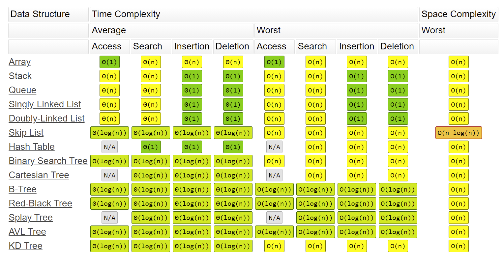
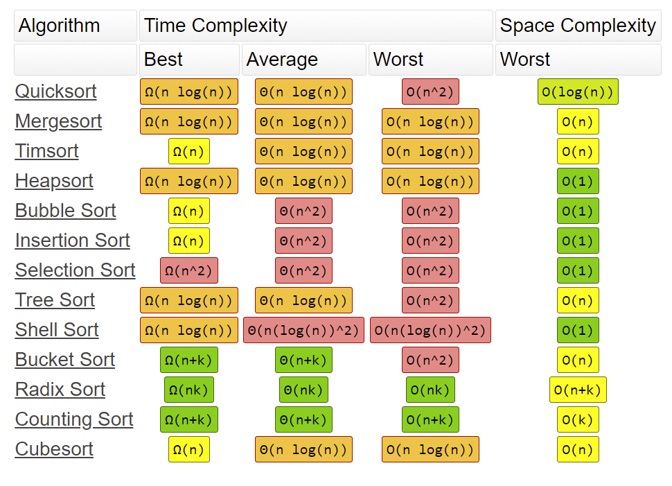

## O(1): Contant
This is constant, so not matter the input size the time taken is the same.

e.g. 
```csharp
public bool IsNull(List<int> list)
{
    return list == null;
}
```

## O(n): Linear
The time take rises equally to the number of items in the input. For example and single loop.

```csharp
public bool Output(List<int> list)
{
    foreach(var item in list)
    {
        Console.WriteLine(item);
    }
}
```

## O(n<sup>x</sup>): Exponential
The time taken rises exponentially as the number of items in the input increases. This usually nested loops.

In this example there are 2 iterators, so this is O(n<sup>2</sup>). The more nested loops there are, the higher the exponential... O(n<sup>3</sup>), O(n<sup>4</sup>)....

```csharp
public void Output(List<List<int>> list)
{
   
    foreach(var item in list)
    {
        foreach(var subItem in item)
        {
            Console.WriteLine(subItem);
        }
    }
}
```

## O(log(n)): Logarithmic

This is where a function quickly normalises after a couple of iterations. This is most likely divide and conquor / recursive functions. Basically, it will split the input by two each time and only work on a smaller input size, therefore reducing the time taken as it progresses through each iteration. 

Some functions are O(n * log(n)), which are less optimal, but still logarithmic. An exmaple of O(n * log(n)) is Quick Sort.

## Examples from https://www.bigocheatsheet.com/

### Data Structures


### Algorithms

